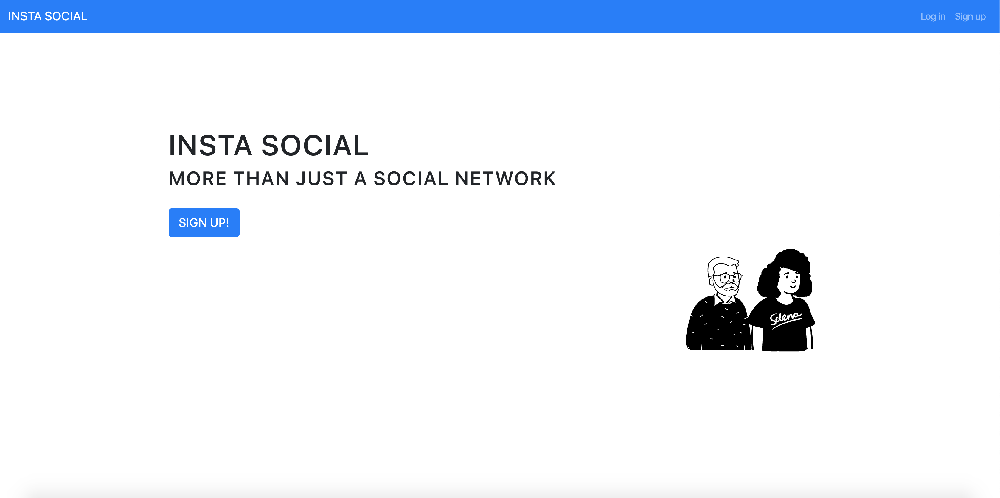

<br />
<p align="center">

  <a href="https://github.com/Redvanisation/insta-social">
    
  </a>

  <h2 align="center">Insta Social</h2>

  <p align="center">
    A full CRUD social network app made using the TDD technique using RSpec and Capybara, Ruby on Rails, Sass, Bootstrap, PostgreSQL and Omniauth.
    <br />
    <br />
    <a href="https://theinstasocial.herokuapp.com/" target="_blank">Live Link</a>
    ·
    <a href="https://github.com/Redvanisation/insta-social/issues">Report Bug</a>
    ·
    <a href="https://github.com/Redvanisation/insta-social/issues">Request Feature</a>
  </p>
</p>

## Live Link

[Insta Social on Heroku](https://theinsta-social.herokuapp.com/)

## Technologies

- HTML
- CSS
- SASS
- Ruby
- Ruby on Rails

## Usage

> Clone the repository to your machine and cd into the directory

```sh
$ git clone git@github.com:Redvanisation/insta-social.git
```

```sh
$ cd insta-social
```

> Use the following command to start the rails server then visit: http://localhost:3000 to use the app

```sh
$ rails s
```

## Functionalities

Project's requirements: [The odin final rails project](https://www.theodinproject.com/courses/ruby-on-rails/lessons/final-project)


The user can:

(Will be developed later)

## Developed by

[Radouane Khiri](https://github.com/Redvanisation") and [Mouhamadou Diouf](https://github.com/MouhaDiouf")

## Contributing

1. Fork it `https://github.com/redvanisation/insta-social/fork`
2. Create your feature branch (git checkout -b feature/[choose-a-name])
3. Commit your changes (git commit -am 'What this commit will fix/add')
4. Push to the branch (git push origin feature/[chosen name])
5. Create a new Pull Request
